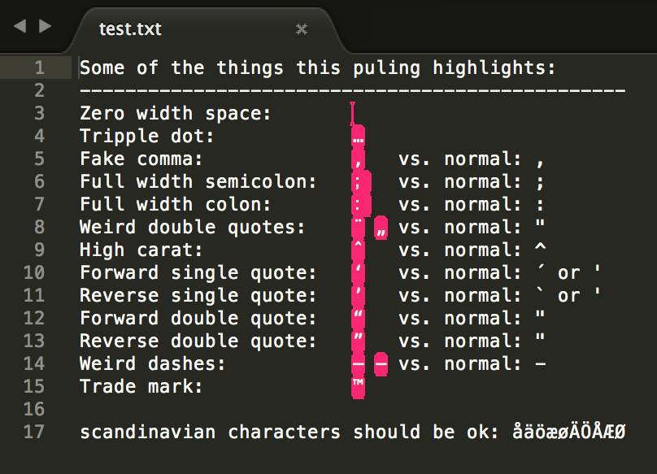

# Highlight non-ascii characters in Sublime Text 3

This plugin highlights non-printable characters excluding whitelisted characters. It makes control characters, zero width spaces, full width colons and other dangerous characters that might break your code visible.

By default the Scandinavian special characters and the euro sign: åäöæø€ are whitelisted. The whitelisted characters can be edited in the settings.

`Sublime Text > Preferences > Package Settings > Highlight Dodgy Chars > Settings - User`

## Installing

The easiest way to install this plugin is with the **Package Control plugin** If you don't have Package Control installed, you can find instructions here: [https://packagecontrol.io/installation](https://packagecontrol.io/installation)

Once you've installed Package Control, restart Sublime and open the Command Palette (Command+Shift+p on OS X, Control+Shift+p on Linux/Windows). Type/select "Package Control: Install Package", wait while Package Control fetches the latest package list, then type/select `Highlight Dodgy Chars` when the list appears.